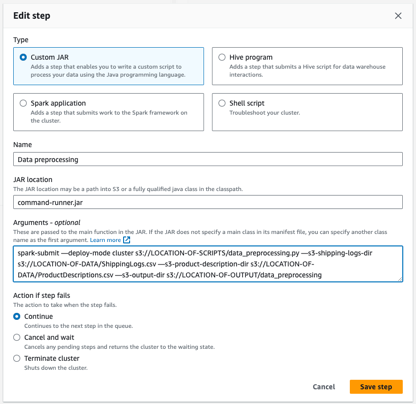

# Build XGBoost on Pyspark to create ML models with Amazon EMR

## Intro

This repository holds a sample code for a PySpark - based Machine Learning model workflow. From the initial read of the raw data to creating predictions using a trained model. The architecture is based on Amazon EMR clusters and leverages CloudFormation Template to spinoff. 

## Security of the solution

In order to create a safe solution please follow best practices of Amazon EMR, you can find them [here](https://aws.amazon.com/blogs/big-data/best-practices-for-securing-amazon-emr/). The solution is using Amazon S3 to keep the data, in order to secure your buckets follow the best practices outlined [here](https://docs.aws.amazon.com/AmazonS3/latest/userguide/security-best-practices.html#security-best-practices-prevent).
## Manual run of steps
Before running the steps automatically with the use of Cloud Formation Template it is worth to walk through the manual process in order to understand the details.
We start with going to the EMR console and creating new cluster:

In order to configure the cluster we do the following:

* select Spark from Application bundle
* For test data we need a primary and only 1 core instance, it is worth to use Spot instances for cost saving if you are running development workloads. In our testing we used m4.xlarge instances, but this choice depends on the size of your data. 
* For Networking choose the VPC and subnet you have for this task
* Security configurations are standard, default Service and IAM roles were used
* Cluster logs - it is worth to keep the logs, simply check the “Publish cluster-specific logs to Amazon S3” box in Cluster Logs section
* Bootstrap Actions - in order to install the prerequisites provide S3 location where the bootstrap.sh file is stored.

### Steps configuration

Next, when creating EMR cluster we need to specify the steps we want it to perform. In our case we have 4 steps:

* Data preprocessing
* Feature engineering for training
* Feature engineering for validation
* Model training

These steps are sequential, meaning that you cannot do next step without finishing the previous one and order matters. For this we cannot leverage the EMR parallelisation of steps, all the steps must be completed in order.
All the steps are configured by selecting the Type, providing Name, JAR location, Arguments and Action if step fails. For all the steps in our case the Type is Customised JAR, JAR location is command-runner.jar, Action if step fails is Terminate Cluster. The steps differ in Name and Arguments. 

### 1. Data preprocessing 

For this step the following Arguments are provided:

`spark-submit —deploy-mode cluster s3://LOCATION-OF-SCRIPTS/data_preprocessing.py —s3-shipping-logs-dir s3://LOCATION-OF-DATA/ShippingLogs.csv —s3-product-description-dir s3://LOCATION-OF-DATA/ProductDescriptions.csv —s3-output-dir s3://LOCATION-OF-OUTPUT/data_preprocessing`

In order to run the step the locations have to be modified. 

### 2. Feature engineering for training

After completion of data preprocessing we can run the feature engineering. For the training arguments are as follows:

`spark-submit —deploy-mode cluster s3://LOCATION-OF-SCRIPTS/feature_engineering.py —s3-dataframe-dir 3://LOCATION-OF-OUTPUT/data_preprocessing/training —s3-output-dir s3://LOCATION-OF-OUTPUT/feature_engineering/training`

### 3. Feature engineering for validation

Same script can be run on validation dataset with the following arguments:

`spark-submit —deploy-mode cluster s3://LOCATION-OF-SCRIPTS/feature_engineering.py —s3-dataframe-dir s3://LOCATION-OF-OUTPUT/data_preprocessing/validation —s3-output-dir s3://LOCATION-OF-OUTPUT/feature_engineering/validation —s3-pipeline-model-dir s3://LOCATION-OF-OUTPUT/feature_engineering/training/pipeline_model`

For validation step we are also saving the pipeline model in order to be able to reuse it with new data and have consistency. 

### 4. Model training

Last step conducted is model training. The arguments are as follows:

`spark-submit —deploy-mode cluster s3://LOCATION-OF-SCRIPTS/model_training.py —s3-training-dataset-dir s3://LOCATION-OF-OUTPUT/feature_engineering/training/dataframe —s3-validation-dataset-dir s3://LOCATION-OF-OUTPUT/feature_engineering/validation/dataframe —s3-output-dir s3://LOCATION-OF-OUTPUT/model_training —model-type gbt —model-params "{'maxIter': 32}"`

After creating all 4 steps and configuring all the other parameters as mentioned above hit the Create cluster button and the EMR Cluster will be created. For our testing the 4 steps took about 15 minutes to complete. After the cluster completed all the tasks you can check if the provided S3 location has been populated with the outputs from the steps. 

## Usage of CloudFormationTemplate
Once you ar familiar with how the steps work in an EMR Cluster you might want to speed up the spin-on process by leveraging a CloudFormation Template. In order to use it head over to CloudFormation console and create new stack (with new resources). In the first panel select Template is ready and provide either S3 location or upload the template. (see screenshot below).

Hit Next and you will open the template where you have to fill the fields with corresponding S3 locations. The data you have to provide is the same as with manual process but here it is more user-friendly and easy. 

After filling all the fields select Next. In the Configure stack options step you can create Tags, Stack Policies etc. In our case we leave them as default. Hit Next, review the provided inputs and if everything looks correct select Submit. This will start the creation of your stack. You can follow the progress of stack creation in the CloudFormation console. Once the stack will be created it’s status will change to CREATE_COMPLETE. As with the manual process you can check if the steps run properly by analysing the outputs in S3 location specified. 

## Usage of CloudFormationTemplate
In order to make this cluster part of your Infrastructure as Code (IaC) Templates a CDK (Cloud Development Kit) implementation of the cluster has been prepared to be used. You can find the code under cdk_mlops directory. In order to use it, you have to provide the S3 locations and subnet ID in the _cdk_mlops/cdk_mlops_stack.py_ script. Once you edit your inputs, you can simply run **cdk deploy** command and the infrastructure will be provisioned. If you have not worked with CDK before you can find step by step explanation [here](https://docs.aws.amazon.com/cdk/v2/guide/getting_started.html).

